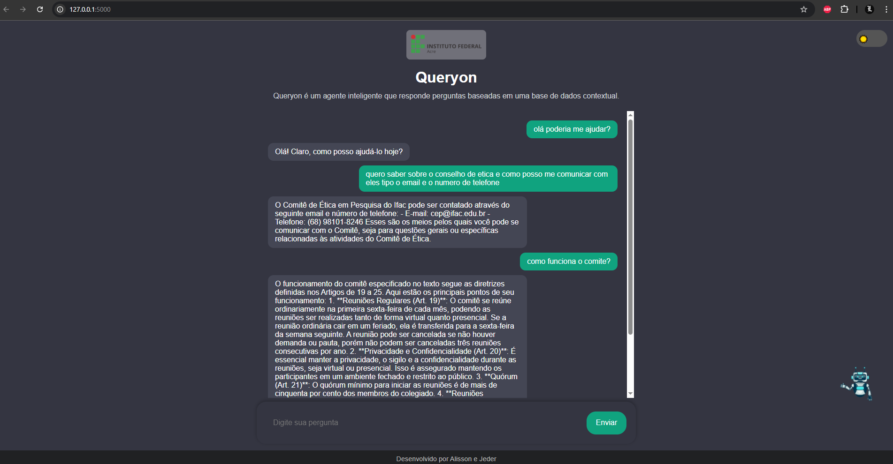

# Agente inteligente RAG - Assistente Inteligente IFAC

<p align="center">
  
</p>

Este é um projeto de Agente inteligente desenvolvido para auxiliar no gerenciamento e consulta de resoluções e documentos no IFAC, utilizando inteligência artificial. O sistema utiliza **web scraping** para coletar automaticamente resoluções públicas do site oficial e responde a perguntas com base nesse conteúdo.

## 📋 Funcionalidades

- Coleta automática de resoluções via web scraping.
- Geração de respostas com base no conteúdo das resoluções coletadas.
- Interface intuitiva e responsiva.
- Busca semântica eficiente utilizando FAISS e embeddings gerados pelo `sentence-transformers`.
- Integração com a API da OpenAI para respostas contextuais.

## 🛠️ Tecnologias Utilizadas

- **Backend**: Flask
- **Banco de Dados**: MongoDB
- **Busca Semântica**: FAISS
- **Processamento de Texto**: BeautifulSoup, Sentence Transformers
- **Frontend**: HTML, CSS, JavaScript
- **Integração com IA**: OpenAI API

## 🚀 Requisitos

Certifique-se de ter os seguintes requisitos instalados no ambiente local:

- Python 3.8 ou superior
- MongoDB (local ou MongoDB Atlas)
- Virtualenv (opcional, mas recomendado)
- Conta na [OpenAI](https://platform.openai.com/) para obter a chave da API

## 🛠️ Instalação e Configuração

Siga os passos abaixo para configurar e executar o projeto:

### 1. Clone o Repositório

```bash
git clone https://github.com/seu-usuario/nome-do-repositorio.git
cd nome-do-repositorio
```

### 2. Crie e Ative um Ambiente Virtual (opcional, mas recomendado)

```bash
python -m venv venv
source venv/bin/activate  # No Windows: venv\Scripts\activate
```

### 3. Instale as Dependências

```bash
pip install -r requirements.txt
```

### 4. Configure as Variáveis de Ambiente

Crie um arquivo `.env` na raiz do projeto com as seguintes configurações:

```env
MONGO_URI=mongodb://localhost:27017/
OPENAI_API_KEY=sua-chave-openai-aqui
```

Substitua `MONGO_URI` pelo URI do seu MongoDB, se estiver utilizando o MongoDB Atlas.

### 5. Configure o Banco de Dados no MongoDB

Certifique-se de que o MongoDB está em execução e crie:

1. O banco de dados **`chatbot_db`**.
2. A coleção **`vectors`** dentro do banco.

No MongoDB Shell, você pode executar os seguintes comandos:

```bash
use chatbot_db
db.createCollection("vectors")
```

Isso garante que o projeto funcione corretamente ao salvar os documentos.

### 6. Execute o Banco de Dados

Certifique-se de que o MongoDB está em execução localmente ou conectado ao Atlas.

### 7. Inicialize o Servidor Flask

```bash
python app.py
```

O servidor estará disponível em [http://127.0.0.1:5000/](http://127.0.0.1:5000/).

---

## 🖥️ Uso

### 1. Coletar e Indexar Resoluções

1. Acesse a interface principal.
2. Clique no botão **"Buscar Resoluções"**.
3. O sistema fará o scraping das resoluções diretamente do site do IFAC e armazenará as informações no banco de dados.

### 2. Consultar o Agente Inteligente

1. Digite sua pergunta no campo de texto.
2. Clique no botão **"Enviar"**.
3. Veja a resposta contextual exibida na área de respostas.

---

## 📂 Estrutura do Projeto

```
chatbot_project/
├── app.py                     # Arquivo principal do Flask
├── routes/                    # Rotas do Flask
│   ├── scraping_routes.py     # Rotas de scraping
│   ├── chat_routes.py         # Rotas do agente
├── services/                  # Lógica central
│   ├── faiss_service.py       # Gerenciamento do FAISS
│   ├── scraping_service.py    # Web scraping e tratamento de texto
│   ├── openai_service.py      # Comunicação com a API OpenAI
├── templates/                 # Arquivos HTML
│   ├── index.html             # Página inicial
├── static/                    # Arquivos estáticos
│   ├── css/
│   ├── js/
├── utils/
│   ├── config.py              # Configurações globais
├── requirements.txt
├── .env
```

---

## ⚙️ Testes

### 1. Teste de Funcionalidades

- **Coleta de Resoluções**: Clique em "Buscar Resoluções" e valide se as informações são extraídas corretamente do site do IFAC.
- **Respostas do Agente**: Faça perguntas relacionadas às resoluções e valide as respostas.

### 2. Teste do Banco de Dados

Verifique se os documentos extraídos e embeddings estão armazenados corretamente no MongoDB.

---

## 📝 Contribuição

Contribuições são bem-vindas! Siga os passos abaixo:

1. Faça um fork do projeto.
2. Crie uma branch para sua feature: `git checkout -b minha-feature`.
3. Commit suas mudanças: `git commit -m 'Adiciona minha feature'`.
4. Faça o push para a branch: `git push origin minha-feature`.
5. Abra um Pull Request.

---

## 🛡️ Licença

Este projeto está licenciado sob a [MIT License](LICENSE).

---

## 📞 Contato

- **Nome:** Jeder  
- **E-mail:** jederbertoldo258@gmail.com  
- **LinkedIn:** [https://www.linkedin.com/in/jeder-valdivino-3700101b0/](https://www.linkedin.com/in/jeder-valdivino-3700101b0/)

---

## 🌟 Agradecimentos

- [OpenAI](https://platform.openai.com/) pela API de IA.  
- [Sentence Transformers](https://www.sbert.net/) pelos modelos de embeddings.  
- Toda a equipe do IFAC pelo apoio ao desenvolvimento deste projeto.  
